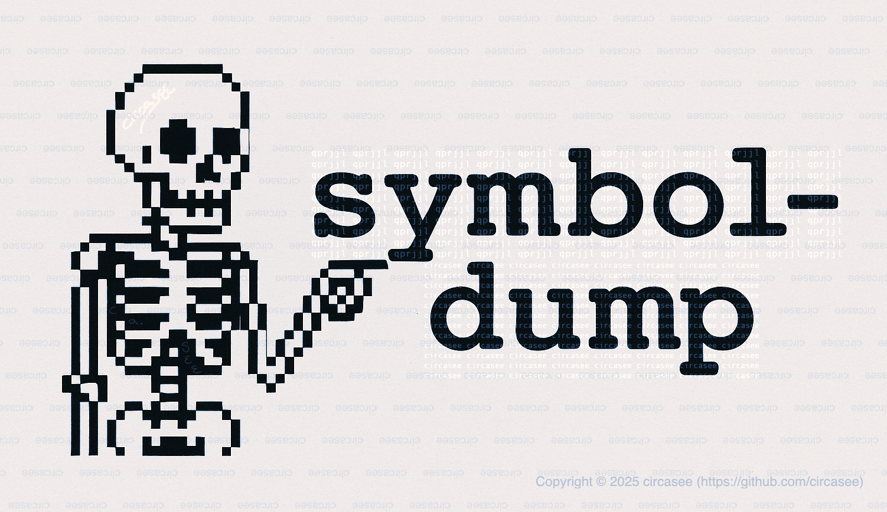

# 🪆 symbol-dump

> A place for saved artifacts, unshipped docs, and long-delayed disclosures.

```
symbol-dump (n.)
1. [noun] A direct or indirect release of program behavior, state, or metadata — such as symbol tables or debugging artifacts.
2. [noun] An artifact or record extracted from compiled binaries that enables introspection, analysis, or manipulation.
3. [this repo] A long tail of advisories, insights, and research fragments — released when they’re ready, even if they’re already old. XD

*“The researcher released a symbol dump years after the original work — annotated, intentional, and finally public.”*
```



---

## 📼 What You'll Find

Markdown files and such. Not all fancy.

Each entry is an artifact: something I’ve written, annotated, or recovered from past work — advisories, experiments, slides, or documentation that didn’t belong anywhere else. Some are solo files, others may be structured as directories with code or context.

💭 Entries may be:
- Independently derived
- Based on old notes
- Delayed out of caution, respect, or signal noise

Some files may be backdated — but will be noted as such. Trying to do the right thing is important. Whether someone trusts that is up to them, but I don’t mind pointing it out.

Drops happen when they’re ready. Even if that means 10 years ago. XD

---

## 🕯️ Quiet Contributions Deserve Quiet Credit

Not all research originates on public platforms.  
Sometimes it lives in zines, obscure blogs, quiet IRC logs, or handwritten notes passed between trusted friends.

When preparing talks or writing, I’ve done my best to trace those paths — and where credit wasn’t possible, I acknowledged the tradition itself.  
Not every author wants visibility. Sometimes, they only wanted to be seen by their peers — not broadcast for mass appeal.

Others may arrive at similar conclusions independently. That’s part of research.  
But this repo exists to clarify my path:  
Where I started, what I discovered, and how I tried to give credit, even when that credit couldn’t be named directly.

This isn’t about ownership. It’s about being intentional — and honoring the unseen where it matters.

---

## 📜 Philosophy

Over-licensing stifles the very community you're trying to protect.  
But under-licensing enables history to be rewritten without acknowledgment.

This repo tries to walk that line with intent:

✅ Educational use is encouraged, even in paid contexts — as long as it's done under license, with attribution, and ideally with a royalty or permission structure in place.  
✅ Rehosting is fine, as long as it’s not exploitative, doesn’t erase attribution, or isn’t used to claim false originality (i.e., no “technicality pirates”).  
🚫 Commercial use must be licensed separately — especially for:
- Closed training programs  
- Gated documentation platforms  
- Private knowledge bases  
- Internal tooling used for monetized services  
- Repackaging or paraphrasing without credit

✅ I retain full rights as the author, including the ability to re-license or revoke previous grants.

> ⚠️ Minor edits to structure, phrasing, or order do not create originality.  
> If the idea is derivative, it still deserves attribution.

---

## 🏴‍☠️ Technicality Pirates

There’s a difference between overlap and erasure.

It’s not about who used what technique.  
It’s about whether credit was given when the source was known — or omitted when it could have been acknowledged.

I’ve seen cases where the same technique gets used by different projects. One author uses it directly. Another integrates it through a third-party wrapper.  
Which one was first? Which one deserves credit?

Maybe both — if they’re honest about how they got there.

But if someone repackages a method, rearranges the words, and claims novelty? That’s not parallel discovery. That’s a technicality pirate.

To be clear: technicality pirates aren’t just people who overlap — they’re the ones who sidestep acknowledgment on purpose. There’s no shame in learning out loud or sharing with humility. Trying to do the right thing — even after the fact — matters.

If you build from others — say so. If I did, I’ll do the same.

---

## 📟 Contact

For licensing or commercial use inquiries,  
please open a GitHub issue labeled `request-for-contact`.

Do not attempt to contact through scraped or indirect means.

---

## 📄 License

This project is released under a custom license designed to:
- Encourage educational use
- Prevent exploitative commercialization
- Ensure proper attribution
- Protect the author’s right to re-license

See [`LICENSE`](LICENSE) for full details.

> Note: The `symbol-dump.png` image is © 2025 circasee. All rights reserved.

---

🧱 Everything here stands on its own.  
🧭 No roadmap. No changelog. No promises.  
💾 Just symbol-dumps.


###### <sub>`hmac-sha512:5a5bd7cd26ac986e365a37eccd52a09cfb34c48221cccd800ce548c1a5dd12d48832333445c9c0fabf643a932ba5eb8f554b45b14fe625e11b3b32538293d167`</sub>
